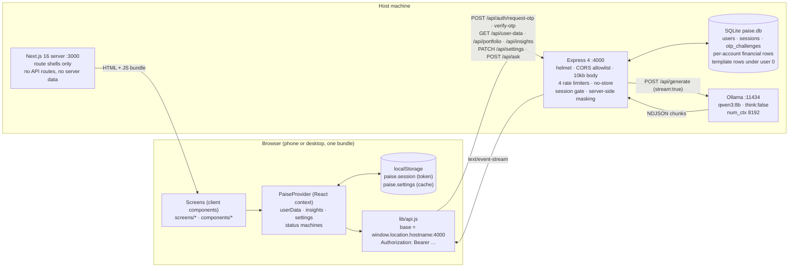
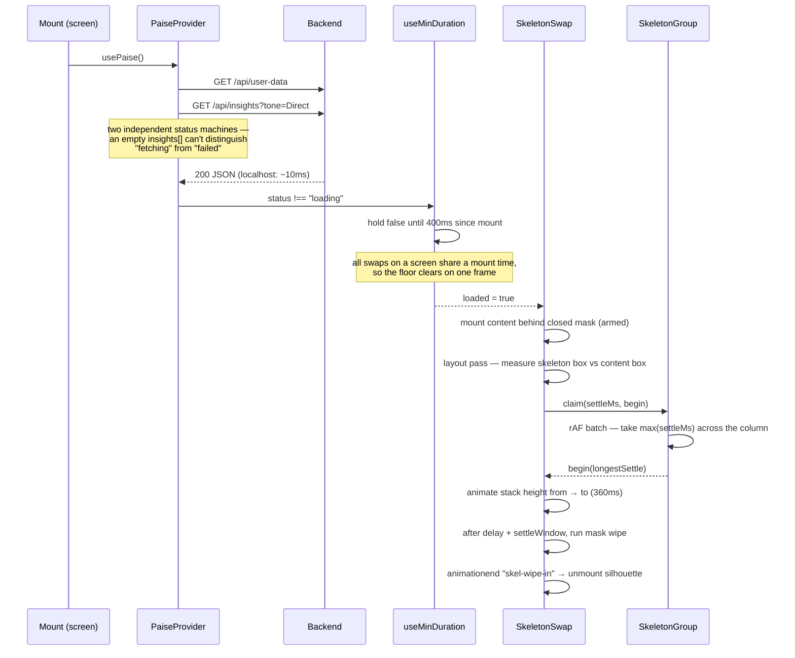
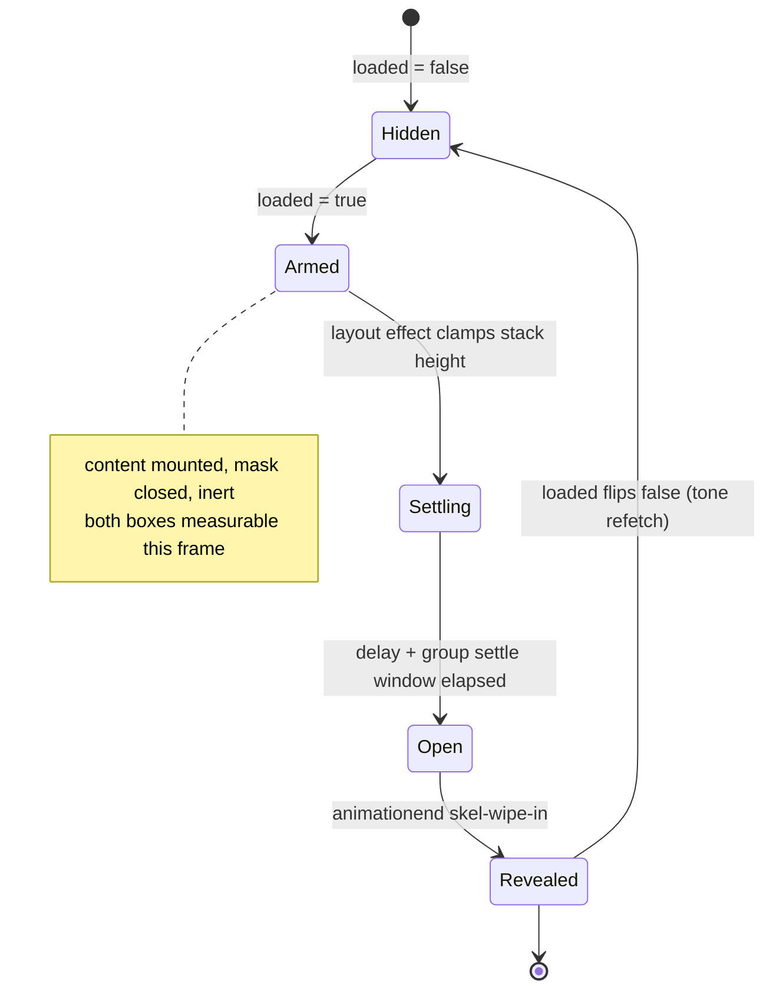
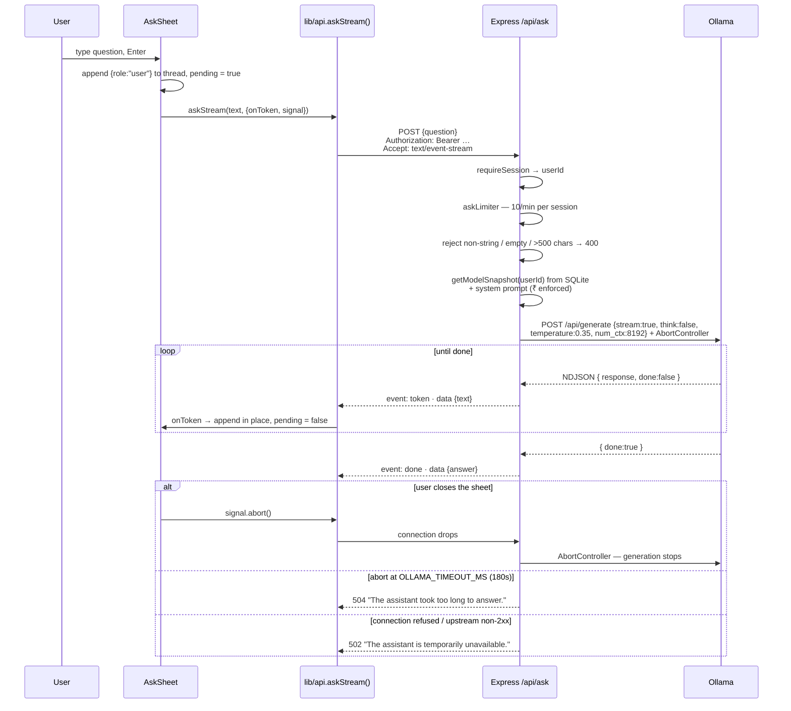
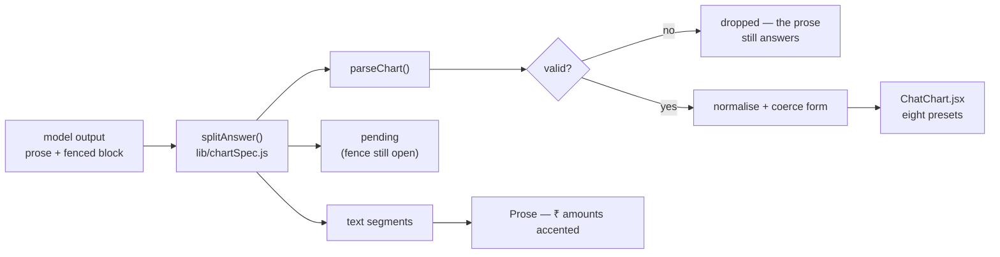
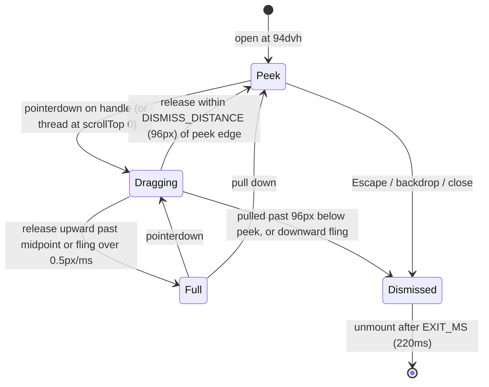
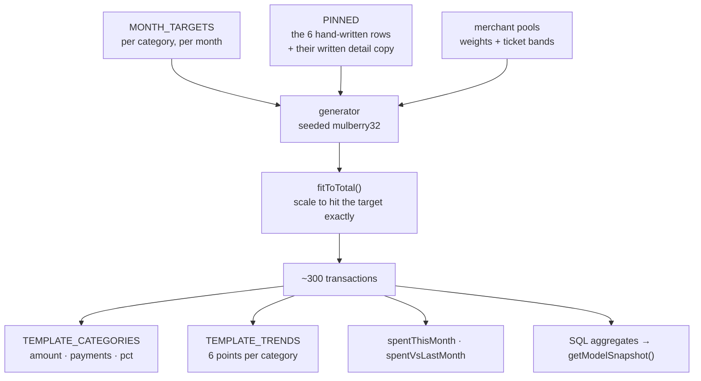
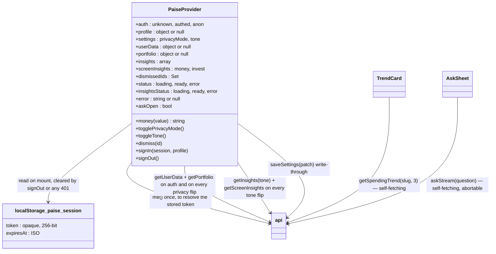

# Paise Architecture

Personal-finance client for a prototype backend. Two processes, one repo, one
SQLite file:

| Half | What it is | Talks to |
|---|---|---|
| [`backend/`](./backend) | Express 4 API on `:4000` — routes, session auth, SQLite, the only thing that reaches the LLM | SQLite (`paise.db`) · Ollama (`127.0.0.1:11434`) |
| [`frontend/`](./frontend) | Next.js 16 App Router client on `:3000` — every screen is a client component | backend API only |

The API surface is documented in [`backend/README.md`](./backend/README.md);
the screen map and the "which number comes from where" table live in
[`frontend/README.md`](./frontend/README.md).

**Inputs:** HTTP GET/POST/PATCH/DELETE from a browser on the same host or LAN;
a 10-digit phone number and a six-digit code on the auth routes; a free-text
question (≤500 chars) on `/api/ask`.
**Outputs:** JSON financial snapshots scoped to one account, tone-conditioned
insight copy, session tokens, and a model-generated answer — streamed as
server-sent events when the caller asks for them.
**Hard dependencies:** Node ≥22.5 (`node:sqlite`, native `fetch`,
`--env-file-if-exists`), and a running Ollama daemon with `qwen3:8b` pulled.
Nothing else: no Postgres, no Redis, no auth provider, no cloud SDK. The
database is a file the server creates and seeds itself on first boot.

---

## System overview



Key boundary: **identity is decided in exactly one place, and every read is
scoped by it.** `requireSession` resolves a bearer token to a user id, and no
query in `db.js` runs without one — there is no route that can return another
account's rows. Sign-in is a phone number and a six-digit code that the server
generates, hashes, expires and single-uses; a verified code mints an opaque
256-bit token whose HMAC is all the database keeps.

The frontend bundle now contains no credential at all. The shared
`NEXT_PUBLIC_PAISE_API_KEY` — one string for every visitor, readable in the
sources panel, unrevocable without a redeploy — is gone.

Second boundary: **"Hide balances" is enforced before serialisation.** With it
on, `netWorth` and every other figure leave the server as `null`; the mask is
not a CSS trick over a payload that still holds the numbers.

The second boundary is the model: `/api/ask` is the sole egress point, and it
egresses to loopback. The financial snapshot is assembled server-side into a
~1KB lean projection (`netWorth`, `safeToSpend`, budget figures, top
categories, subscriptions) — never the full internal structure — and never
leaves the host.

### Why the API base is derived, not configured

`lib/api.js:apiBase()` resolves `window.location.protocol + hostname +
NEXT_PUBLIC_API_PORT` unless `NEXT_PUBLIC_API_BASE_URL` is set. A phone opening
`http://10.216.147.211:3000` therefore calls `http://10.216.147.211:4000` —
the host's API, not its own loopback — with zero per-device configuration. The
SSR branch falls back to `localhost` and is never exercised for data, because
no screen fetches on the server.

---

## Core workflow 1 — cold start and the skeleton pipeline

The single most involved algorithm in the codebase is not the data fetch; it is
the swap from silhouette to content. `SkeletonSwap` (`components/Skeleton.jsx`)
runs a measure → settle → wipe pipeline so the column never jumps.



State per swap:



Load-bearing details:

- **`armed` vs `loaded` are separate flags.** Content mounts in the same commit
  the data lands, behind a closed mask, so there is a real box to measure on
  the very next layout pass. Unmounting the silhouette at `loaded` instead
  leaves a blank gap for the ~1.3s the wipe takes.
- **The height clamp holds for the whole reveal, not just the settle.** The
  silhouette is usually taller; whatever the guess got wrong would otherwise
  shimmer under the card for the length of the wipe.
- **`SkeletonGroup` exists to defeat out-of-order fills.** Members claim from
  their layout effects within one commit; one `requestAnimationFrame` later the
  batch is complete and every member clocks its wipe off the slowest settle. A
  card with no correction to make would otherwise reveal *before* one that had
  a line's worth, inverting the top-down stagger.
- **`useMinDuration` (400ms floor)** exists because the API is normally
  loopback. Without it a skeleton is a 10ms blink.
- **`settled` ref is a one-shot guard** against React 19 StrictMode's
  double-invoked effects replaying the settle.
- `prefers-reduced-motion` collapses settle and wipe to ~0ms while still firing
  the `animationend` events the state machine depends on.

## Core workflow 2 — Ask Paise



- Streaming is opt-in per request: without `Accept: text/event-stream` the same
  route answers with one `{ answer }` JSON body. `askStream` handles both, so a
  non-streaming reply is still rendered rather than treated as a failure.
- The snapshot is read from the signed-in account's rows. Nothing in the
  request body reaches the prompt except the question itself.

- `think: false` is not cosmetic: hybrid-reasoning models (qwen3) otherwise
  spend the entire token budget in `thinking` and return an empty `response`.
- `num_ctx` must stay ahead of the prompt. An oversized prompt is **not**
  truncated by Ollama — it wedges the runner at 100% CPU and every later
  request queues behind it. The system prompt is ~900 tokens and the snapshot
  ~1,000, against an 8192 window.
- Upstream error bodies are logged server-side and never forwarded; clients get
  a fixed generic string. Same policy in the 500 handler.
- 180s is deliberate: an 8B model on CPU answers in tens of seconds, and a
  prompt that asks it to reason first pushes that to about 100s. A shorter
  timeout converts slow answers into 502s.

### The snapshot is shaped for an 8B model, not for a human

`getModelSnapshot()` is not a dump of the account. Three decisions in it exist
because of specific failures observed with qwen3:8b:

| Decision | The failure it fixes |
|---|---|
| Every quotient precomputed (`avgWeekendPayment`, `vsLastMonthPct`, `sixMonthAvg`) | Asked for "11 weekend orders averaging X", the model divided the month's whole category total by 11 and was 47% wrong |
| Self-describing keys, no positional tuples | `[weekend, weekday, weekendCount, weekdayCount]` had the weekend total read out of the month-change slot and quoted as a month-on-month change |
| `budgetStatus` as a finished sentence | Both a signed number and a boolean were read backwards — "₹3,580 over budget" when ₹3,580 was what remained |

The pattern: for anything the model gets wrong by reasoning, hand it the
conclusion. It costs a few hundred bytes of context and removes a class of
error that no amount of prompt wording did.

## Core workflow 2b — answers that draw

An answer can carry a chart. The model appends a fenced block; the client
renders it. The model never emits markup, colours, or sizes.

````text
Weekends. Food hit ₹11,900 in August against ₹7,700 in July …

```paise-chart
{"type":"bar","title":"food & delivery · last 6 months",
 "data":[{"label":"JUL","value":7700},{"label":"AUG","value":11900}]}
```
````



- **The model chooses a shape, never an appearance.** `type` is one of eight
  names; colour may only be one of seven *tokens*. A hex it invented is
  discarded. Nothing it writes reaches the DOM as markup.
- **Everything is bounded.** Unknown types are rejected, arrays capped (8
  points, 6 donut slices, 5 stack parts), labels truncated, values coerced to
  finite numbers. A malformed block renders as nothing rather than as an error.
- **Forms are corrected, not just accepted.** A one-bar bar chart and a
  two-slice donut are both really a figure, so they are redrawn as `stat` and
  `breakdown`. A `progress` with no target becomes a `breakdown`.
- **Streaming is handled at the split.** While the closing fence has not
  arrived the tail is a `pending` segment, so half-written JSON is never shown
  as text.
- **Colour has two jobs and two palettes.** An ordered series (months, days)
  gets one hue stepped light→dark by position — never by value, which would
  double-encode bar height. A set of named things gets the category's own
  colour from the rest of the app, so "the rust one" means the same thing in a
  chat answer as on the Money tab. The categorical order was fixed by running
  the palette through a CVD validator: worst adjacent pair ΔE 8.4 under
  deuteranopia, 16.9 under normal vision.
- **Nothing is reachable by hover alone.** Every preset ships a collapsed
  `<details>` table of its own values, and hover and keyboard focus show the
  same tooltip.

## Core workflow 3 — sheet drag physics

`lib/useSheetDrag.js` drives the Ask sheet on phone (`<900px`) only. Two
detents; while a finger is down the sheet is written through two CSS custom
properties (`--sheet-h`, `--drag-y`) — one style write per frame, **zero React
renders**. On release the inline values are dropped and CSS transitions to the
detent.



`INTENT = 6px` of slop separates a pull from a scroll inside the thread; a
`moved` ref stops the click that terminates a drag from also toggling the
detent the gesture just chose. Above 900px `enabled` is false and the sheet is
a static right slide-over.

## Route transitions

`components/PageMotion.jsx` has no exit animation to run — Next remounts
screens on navigation, so there is no old tree. Direction is inferred instead:

- Two lanes: `["/", "/money", "/invest"]` and
  `["/login", "/otp", "/profile", "/connect", "/empty"]`.
- Same lane, higher index → `next` (enter from right); lower → `prev`.
- Into a screen off the map (`/settings`) → `push`; back out → `pop`.
- Previous path lives in **module scope**, not a ref, because the component
  remounts every navigation. `resolve()` short-circuits on the server: module
  state is shared across requests there, so it would hand one visitor a
  direction computed from another's route and mismatch hydration.
- The wrapper is applied to screen content only — never the tab bar, sidebar or
  sheet. An animated `transform` on an ancestor makes descendant
  `position: fixed` resolve against that element instead of the viewport.

---

## Data and state model

One SQLite file, `PAISE_DB_PATH` (default `backend/paise.db`), created and
seeded on first boot. The template dataset in `seed.js` is loaded once under
the reserved owner id **0**; every account provisioned by a verified code gets
its own row-level clone of it, so two phones signing in no longer share one
object.

`seed.js` carries a `TEMPLATE_VERSION`. When it moves, boot drops every data
row, rewrites the template, and re-clones it into every existing account —
users, sessions, settings and dismissals are untouched, so a dataset change
does not sign anyone out or hand back a card they had closed. New *columns* on
existing tables are added by `ensureColumn()`, because `CREATE TABLE IF NOT
EXISTS` never alters one.

### The fixture is a ledger, and everything else is derived from it

The dataset used to be six hand-written August transactions plus a set of
totals asserted alongside them. That is enough to draw the screens and not
enough to answer a question: "is this normal for me?" had no second data point,
and the totals could drift from the rows without anything noticing.

`seed.js` now generates a **six-month ledger** — 2026-03-01 to the fixture's
own "today", 2026-08-26 — and the category totals, the trend series, the
weekend splits and the model's snapshot are all computed *from* it, in SQL.



Two rules make that safe to do:

1. **Every number the design already showed is a target, not an output.** The
   Jun/Jul/Aug rows of `MONTH_TARGETS` reproduce the old trend series to the
   rupee, and `FOOD_WEEKEND_TARGET` pins August weekend food at ₹8,100 across
   11 Fri–Sun orders. So the insight copy, the seeded Ask thread and the Money
   tab all still say true things — but now they are *checkable*, because the
   rows they describe exist. The six hand-written transactions are pinned into
   August verbatim and their amounts are spent against the target rather than
   added to it.
2. **Generation is deterministic.** One seeded PRNG, no `Math.random`, no
   `new Date()`. Two boots produce identical rows, so a demo never shifts.

The one number that moved: `spentVsLastMonth` was 4,200 (which is the *food*
delta, not the month's) and is now the ledger's own arithmetic, 6,180.

```mermaid
erDiagram
    users ||--o{ sessions : "has"
    users ||--|| settings : "has"
    users ||--|| snapshots : "has"
    users ||--|| portfolios : "has"
    users ||--o{ milestones : "has"
    users ||--o{ categories : "has"
    users ||--o{ transactions : "has"
    users ||--o{ accounts : "has"
    users ||--o{ subscriptions : "has"
    users ||--o{ spending_trends : "has"
    users ||--o{ holdings : "has"
    users ||--o{ sips : "has"
    users ||--o{ goals : "has"
    users ||--o{ screen_insights : "has"
    users ||--o{ dismissed_insights : "has"
    otp_challenges }o--|| users : "provisions on verify"

    users {
        int id PK
        string phone UK "10 digits, normalised"
        string name
        string initials
        int age
    }
    sessions {
        string token_hash PK "HMAC-SHA256 — the token itself is never stored"
        int user_id FK
        string expires_at "24h default"
        string last_seen_at
    }
    otp_challenges {
        string id PK "uuid, the only thing the client carries forward"
        string phone
        string code_hash "HMAC — the code itself is never stored"
        string expires_at "5 min default"
        int attempts "capped at 5"
        string consumed_at "single-use"
    }
    snapshots {
        int user_id PK
        int net_worth "₹ paise-free integers throughout"
        int safe_to_spend "day-to-day figure"
        int forecast_remaining "burn-rate projection — NOT safe_to_spend"
        int monthly_budget
        int milestone_progress_pct "fill toward NEXT unreached milestone"
    }
    categories {
        string slug "food-delivery · rent · travel-cabs · subscriptions · shopping"
        int amount
        int payments
        int pct
        string color "was CATEGORY_COLORS in the bundle"
    }
    transactions {
        string merchant
        int amount
        string occurred_at "ISO"
        string note "expanded-row copy — was TX_DETAIL in the bundle"
        string account
    }
    spending_trends {
        string slug "same key space as categories"
        string month "YYYY-MM"
        int amount
    }
    settings {
        int user_id PK
        bool privacy_mode "enforced server-side before serialisation"
        string tone "Direct or Warm"
    }
```



**`safe_to_spend` and `snapshots.forecast_remaining` are not interchangeable.**
The first is the Home / Cash-flow day-to-day number; the second is Invest's
"idle cash" burn-rate projection. Both READMEs call this out; keep them
separate.

Cloning is an explicit list of `INSERT … SELECT` statements in `db.js`
(`CLONE_STATEMENTS`) rather than a loop over `sqlite_master`, so adding a table
forces a decision about whether it is per-account data. The whole clone runs in
one transaction — a half-provisioned account is never observable.

### Client state

| Tier | Owner | Lifetime | Contents |
|---|---|---|---|
| Account data | SQLite `paise.db` | disk, survives restarts | every table above, scoped by `user_id` |
| Generated copy | `buildInsights(tone)` in `server.js` | request | the three tone-conditioned Home cards |
| Credential | `localStorage["paise.session"]` | 24h or until Log out | `{ token, expiresAt }` — no user data |
| Screen state | `PaiseProvider` context | tab | `userData`, `portfolio`, `insights`, `screenInsights`, `dismissedIds`, `profile`, `auth`, `status`, `insightsStatus`, `error`, `askOpen` |
| Settings cache | `localStorage["paise.settings"]` | device | `privacyMode`, `tone` — a first-paint cache only; the server's copy wins |
| Sign-in challenge | `sessionStorage["paise.challenge"]` | tab, 5 min | `challengeId`, `phone` — never the code |
| Design-only content | `frontend/data/mock.js` | bundle | `FEATURE`, `ASK_SEED`. That is all that is left of it. |



`auth` has three states, and the third is load-bearing: `"unknown"` is the
frame or two before the stored token has been checked. `AppShell` renders
nothing there, which is what stops a signed-in reload from flashing the
sign-in screen on its way back.

Two fetch owners sit outside the provider on purpose: `TrendCard` and
`AskSheet` are mounted conditionally and their data is scoped to one card / one
thread, so hoisting them into context would fetch for screens that never render
them.

Privacy is now two layers that compose. The server drops the figures before
serialising (`maskUserData` / `maskPortfolio`), so the payload carries `null`;
`money(value)` then renders the `MASK` constant (`₹ • • •`) rather than an
em-dash. The client layer alone was the old, defeat-it-with-devtools version —
it survives only as the presentation half. Currency is
`Intl.NumberFormat("en-IN")`, so grouping is lakh/crore, not thousands.

---

## Codebase internals

```
backend/
  server.js         720 lines, the HTTP layer. In order: env parse · RFC1918
                    origin regex · lanAddresses() for the startup banner ·
                    trust proxy 1 · morgan · helmet (CSP off — JSON only) ·
                    CORS allowlist + LAN escape hatch · 10kb json limit ·
                    four rate limiters (general · otp-request · otp-verify ·
                    ask) keyed by session when there is one · no-store on
                    /api · bearer() + requireSession · auth routes ·
                    buildInsights(tone) · maskUserData / maskPortfolio ·
                    data routes · /api/ask with an SSE branch · 404 ·
                    error handler (CORS → 403, 413, else generic 500) ·
                    expiry sweep every 10 min · listen on 0.0.0.0
  db.js             Schema DDL, the versioned template seed, the per-account
                    clone, the SQL aggregates behind the model snapshot, and
                    every read — all scoped by user id, all through prepared
                    statements.
  auth.js           184 lines. OTP issue/verify, session mint/resolve/revoke,
                    HMAC pepper (env or generated-and-stored), timing-safe
                    compare, phone normalisation, expiry sweep.
  seed.js           The template dataset: targets, pinned rows, and a seeded
                    generator that builds a six-month ledger from them. The
                    category totals and trend series are derived from that
                    ledger, not asserted beside it. Nothing reads this file at
                    request time.
  .env.example      PORT · ALLOWED_ORIGINS · ALLOW_LAN_ORIGINS ·
                    PAISE_DB_PATH · PAISE_AUTH_SECRET · OTP_DELIVERY ·
                    OTP_TTL_MS · OTP_MAX_ATTEMPTS · SESSION_TTL_MS ·
                    OLLAMA_URL/MODEL/NUM_CTX/TIMEOUT_MS

frontend/
  app/              Route shells. Server components that do nothing but pick
                    a screen and set metadata; money/page.jsx is the only one
                    with logic (awaits searchParams for ?tab=insights).
    layout.jsx      next/font (DM Sans · Mulish · Instrument Serif) →
                    CSS variables, global CSS imports, <Providers>
    providers.jsx   client boundary — wraps everything in PaiseProvider
  screens/          One file per route. Money.jsx (527 lines) is the largest:
                    Cash flow / Insights tabs, milestones, transaction detail
                    expansion. Auth.jsx and Otp.jsx are a real two-step
                    sign-in against /api/auth/*; Profile and Connect are still
                    navigation only.
  components/
    AppShell.jsx    the two-density shell, and the auth gate: no session, no
                    render — it redirects to /login instead
    Skeleton.jsx    Skeleton · SkeletonReveal · SkeletonSwap · SkeletonGroup
                    (the measure/settle/wipe pipeline above)
    skeletons/      eight per-shape silhouettes matched to real components
    AskSheet.jsx    dialog semantics (focus trap, Escape, focus restore), body
                    scroll lock, seeded thread cascade, drag wiring on phone
                    only, a streamed answer that aborts when the sheet closes,
                    and AnswerBody — prose and charts interleaved as the
                    tokens arrive
    PageMotion.jsx  lane-based route direction inference
    ChatChart.jsx   the eight chart presets an answer can ask for. Owns every
                    visual decision; the model only names a shape and points
                    at data.
    TrendCard.jsx   the design's seeded trend card — now a spec handed to
                    ChatChart, so the shipped card and a generated one are
                    literally the same component
    Amount.jsx      regex-splits copy to tint ₹ figures
  lib/
    session.js      72 lines — where the bearer token lives, and the note on
                    why it is not a cookie yet
    api.js          217 lines — base-URL derivation, Authorization injection,
                    ApiError, 401-clears-the-session, and askStream()'s SSE
                    frame parser
    store.jsx       253 lines — PaiseProvider: auth resolution, two status
                    machines, settings write-through, dismissal set
    format.js       rupees · signedRupees · pct · shortDate · cardDate ·
                    monthLabel · MASK, all en-IN
    chartSpec.js    splits a streaming answer into prose and chart blocks,
                    then validates and bounds every field of the spec. The
                    trust boundary between model output and the DOM.
    useSheetDrag.js 225 lines of pointer physics, detents, fling detection
    useMinDuration.js  400ms skeleton floor
    useDismissed.js    account-scoped "Not now", backed by /api/dismissed
  styles/           tokens.css (design tokens lifted 1:1 from the canvas) ·
                    app.css 1476 lines (phone) · desktop.css 428 lines
                    (everything inside @media min-width:900px) ·
                    skeleton.css 186 lines (shimmer + wipe keyframes)
  data/mock.js      42 lines. Down from 220 — the feature card and the seeded
                    Ask thread are all that is not account data.
```

Rate limits: 120/min per session (or per IP when signed out) across `/api`,
10/min on `/api/ask`, 5 per 15 min on code issuance, 20 per 15 min on code
verification. `/health` is unauthenticated and outside all of them.

---

## Environments and building

| Concern | Dev | LAN demo | Notes |
|---|---|---|---|
| Backend | `npm run dev` (node `--watch`) :4000 | `npm start` :4000 | binds `0.0.0.0` explicitly |
| Frontend | `npm run dev` (`next dev -H 0.0.0.0`) :3000 | `npm run build && npm start` | dev mode is markedly slower on a phone |
| Model | Ollama `qwen3:8b` on loopback | same | `ollama pull qwen3:8b` |
| Origins | `ALLOWED_ORIGINS=http://localhost:3000` | `ALLOW_LAN_ORIGINS=true` | LAN flag accepts any RFC1918 `http:` origin |
| API base | derived from `window.location` | same | leave `NEXT_PUBLIC_API_BASE_URL` unset |
| Auth | sign in with any number; code in the server log | same, or `OTP_DELIVERY=response` for unattended phones | no credential in the client bundle |
| Database | `./paise.db`, seeded on first boot | same | `npm run reset-db` to start over |

Node ≥22.5 is enforced by `backend/package.json:engines` — `node:sqlite` needs
it. The frontend needs ≥18 for Next 16. Neither half has a Dockerfile, a CI config, or a test suite —
`npm test` in `backend/` is `echo "No tests yet" && exit 0`.

Swapping the model is one env var (`OLLAMA_MODEL`), and swapping the whole
provider is one `fetch` call in `/api/ask`. Nothing else in either half knows
an LLM exists.

**Why this is not deployed split-host:** an HTTPS page (Vercel) cannot
`fetch()` a plaintext `http://192.168.x.x` API — mixed content, blocked before
the request leaves the browser, so no CORS setting on the server can rescue it.
Reaching a laptop from a hosted frontend needs an HTTPS tunnel in front of the
backend. Serving both halves from the host removes the problem; see
[`README.md`](./README.md) for the hotspot procedure.

---

## Known v1 tradeoffs

Eight of the original twelve are closed. What closed them is in
[`README.md → Security`](./README.md#-security); what is left is below, and the
list is deliberately unflattering.

### Still true

1. **No SMS gateway.** A code is real — generated, hashed, expiring,
   single-use, attempt-capped — but it is delivered to the server's terminal
   (`OTP_DELIVERY=log`) or, for an unattended demo phone, returned in the
   response body (`OTP_DELIVERY=response`). The second one hands a working
   credential to anyone who can reach the port. It is a demo affordance, it
   warns at boot, and it must never be on off your own machine.
2. **The token lives in `localStorage`, not an httpOnly cookie.** The API is a
   different origin over plain HTTP on a LAN demo, and a cross-site cookie
   needs `SameSite=None`, which browsers only honour with `Secure`. Behind TLS
   this becomes a one-file change (`lib/session.js`); until then a XSS bug
   would reach the token.
3. **No TLS of its own.** Everything is `http://` on a LAN. Put it behind a
   reverse proxy or a platform that terminates TLS before it is reachable over
   any network you do not own.
4. **Rate limiting is in-process memory.** Single instance only; `trust proxy 1`
   is set but horizontal scaling needs a shared store. The same goes for the
   expiry sweep, which is a `setInterval` in the one process.
5. **Sign-in provisions rather than authenticates a person.** Any valid Indian
   mobile number that can receive its own code gets an account, seeded with the
   same fixture. There is no KYC, no account aggregator, no real bank link —
   the numbers are a fixture, and every account starts with an identical copy
   of it.
6. **Ollama is a hard single point of failure and a slow one.** An 8B model on
   CPU takes tens of seconds. Streaming turns that wait into reading time, but
   it does not make it fast, and a prompt exceeding `num_ctx` wedges the runner
   rather than truncating.
7. **No tests, no type checking.** Plain JavaScript on both sides; the only
   automated gate is `next lint` / `eslint`. `npm test` in `backend/` is still
   `echo "No tests yet"`. For a codebase that now has an auth path, this is the
   most expensive item on this list.
8. **`/api/subscriptions` is served but no screen fetches it.** The endpoint is
   real and the model snapshot uses it server-side; the Money tab's
   "3 subscriptions you forgot" card is a stored insight rather than a render
   of that list.
9. **The skeleton pipeline is measurement-dependent.** `SkeletonSwap` reads
   `offsetHeight` on both layers in a layout effect — content whose height
   depends on late-loading webfonts or images can settle to a stale box.
   `next/font` mitigates the font case; images are not used on these screens.
10. **`node:sqlite` is an experimental Node API.** Stable enough to build on at
    Node 22.5+, and the warning is suppressed in the start script, but the
    surface can change across majors. It is one module (`db.js`) to swap.

### Closed, and by what

| Was | Now |
|---|---|
| No persistence — module-scope constants, a restart was the only "write" | SQLite (`node:sqlite`), schema created and seeded on first boot, `PAISE_DB_PATH` |
| No user model — one dataset shared by every caller | A row-level clone of the template per account; every read scoped by session user id |
| `PAISE_API_KEY` compared with `===`, shipped in the client bundle | Opaque 256-bit session tokens, HMAC-stored, `timingSafeEqual` on the code path, nothing secret in the bundle |
| Privacy mode masked at render — devtools saw through it | Masked before serialisation; the figures are not in the payload |
| Auth screens were theatre — any six digits advanced | Real challenge: hashed, 5-minute expiry, single-use, five attempts, rate-limited issuance |
| `data/mock.js` was a parallel data source (220 lines) | 42 lines, none of it account data — holdings, SIPs, goals, tx detail, profile and colours all come from the API |
| No streaming — the sheet showed a pending state for the whole round trip | Server-sent events; first tokens land in about a second and the sheet aborts generation when it closes |
| `backend/README.md` documented an `ANTHROPIC_API_KEY` path that no longer existed | Rewritten against the code that is actually there |
